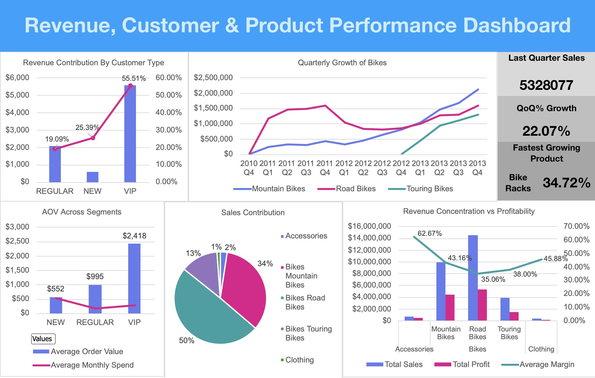

# Revenue–Customer–Product Analysis

SQL-driven business analytics project analyzing customer behavior, product performance, and revenue growth, culminating in an executive-style Excel dashboard.

---

## Overview

This project analyzes a retail sales dataset to understand **who drives revenue, which products matter most, and how growth and profitability evolve over time**.  
The objective was to transform raw transactional data into **actionable business insights** using SQL for data modeling and Excel for visualization.

The final output is an **executive-ready dashboard** designed to support strategic decision-making.

---

## Dataset

- **Source:** Retail sales dataset (PostgreSQL)
- **Time Period:** 2010–2014
- **Total Revenue Analyzed:** **$29.35M**
- **Core Tables:**
  - Customers (demographics, lifecycle)
  - Products (category, subcategory, cost)
  - Sales transactions (orders, quantity, revenue)

---

## Project Workflow

1. Loaded raw customer, product, and sales data into PostgreSQL  
2. Designed SQL views to create:
   - Customer-level performance metrics
   - Product-level sales, profit, and margin analysis
3. Exported processed datasets into Excel
4. Built an executive-style dashboard using PivotTables, charts, and KPI cards

---

## Key Business Questions

- Which customer segments contribute most to total revenue?
- How does order behavior differ across customer types?
- Which products and categories drive revenue and profit?
- How is revenue growth evolving over time?
- Where is revenue concentrated, and what risks does this create?

---

## Executive KPIs (Latest Quarter)

- **Last Quarter Sales:** $5.33M  
- **Quarter-over-Quarter Growth:** 22.07%  
- **Fastest Growing Product:** Bike Racks (+34.72% QoQ)

---

## Key Insights

- **VIP customers contribute 55.5% of total revenue** despite being a smaller segment, driven by significantly higher spending behavior
- **New customers contribute 25.4% of revenue**, reflecting shorter customer lifetime rather than lower order value
- Revenue is **highly concentrated in Bikes (96.5% of total revenue)**, creating category concentration risk
- **Road Bikes historically contributed ~50% of total revenue**, but **Mountain Bikes have overtaken Road Bikes in recent quarters**
- Accessories show **high average margins (~63%)** but low revenue contribution, indicating potential for bundling or upsell strategies
- Clothing contributes **<2% of revenue**, suggesting either underinvestment or a non-core category

---

## Customer Behavior Analysis

- **Average Order Value (AOV):**
  - VIP: **$2,418**
  - Regular: **$995**
  - New: **$552**
- VIP customers generate higher revenue through **larger order sizes**, not just higher frequency
- Average days since last order is consistent across segments, indicating **value differentiation rather than engagement differences**

---

## Product & Profitability Analysis

- **Top Revenue Categories:**
  - Bikes: **$28.31M (96.5%)**
  - Accessories: **$0.70M (2.4%)**
  - Clothing: **$0.34M (1.2%)**
- **Margin Trade-offs:**
  - Accessories: High margin, low revenue
  - Bikes: High revenue, lower margins (35–43%)
- Growth analysis shows **Mountain Bikes accelerating faster than Road Bikes** in later quarters

---

## Business Recommendations

- Reduce revenue concentration risk by expanding high-margin Accessories through bundling with Bikes
- Continue investing in Mountain Bikes growth while improving margins via pricing or cost optimization
- Implement retention strategies to convert New customers into Regular and VIP segments
- Closely monitor Road Bikes to prevent margin erosion as growth slows

---

## Tools & Skills Demonstrated

- **SQL (PostgreSQL):** CTEs, aggregations, date-based analysis, business logic modeling
- **Excel:** PivotTables, KPI cards, combo charts, executive dashboards
- **Business Analytics:** Customer segmentation, revenue concentration analysis, profitability trade-offs

---

## Dashboard Preview

